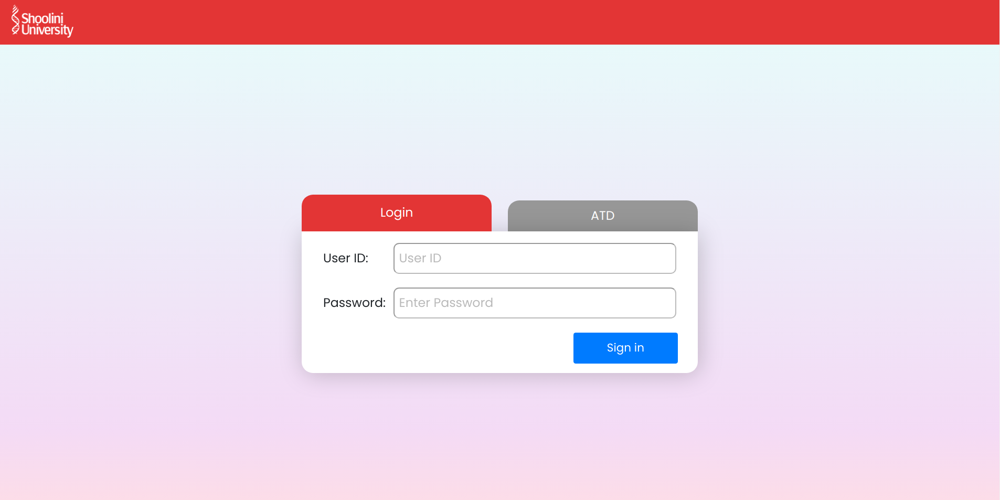
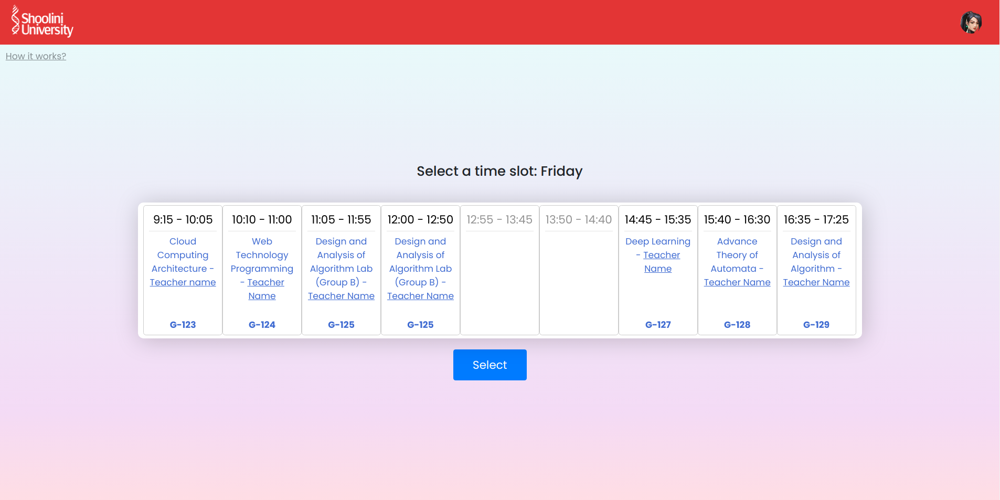
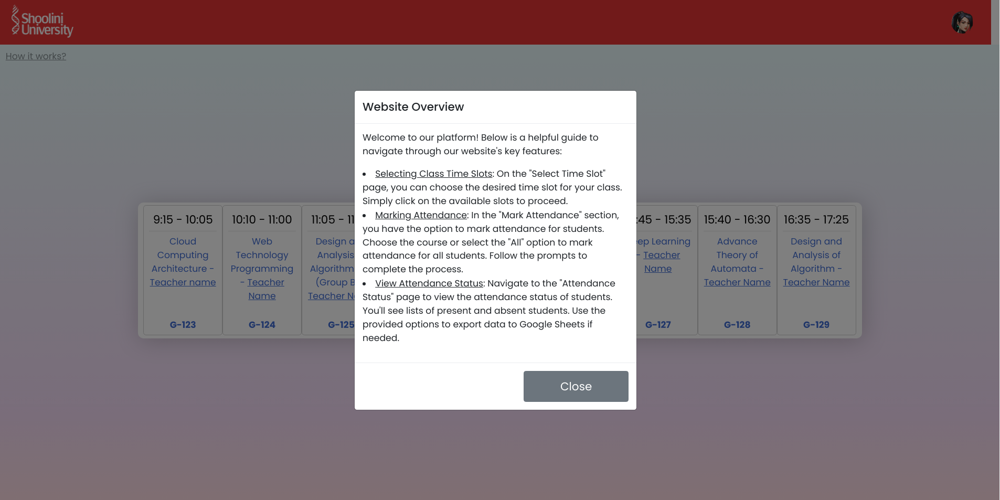
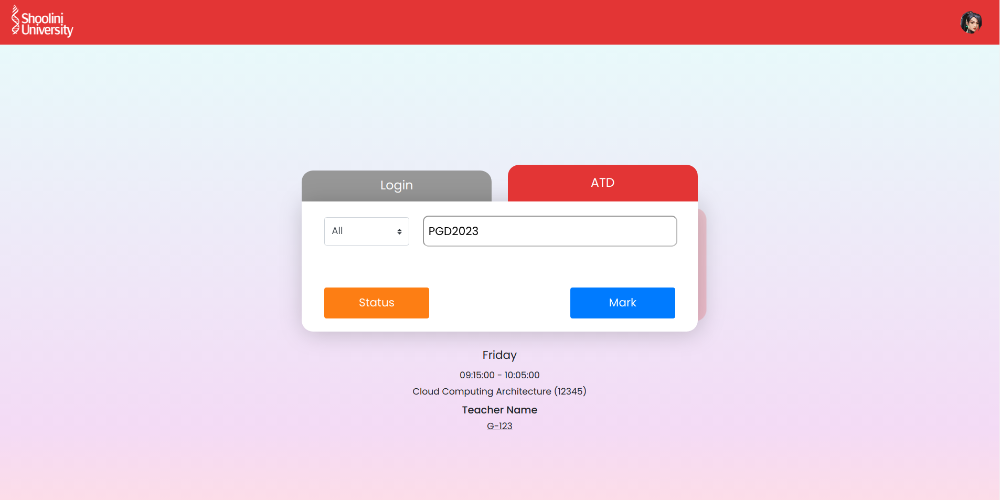
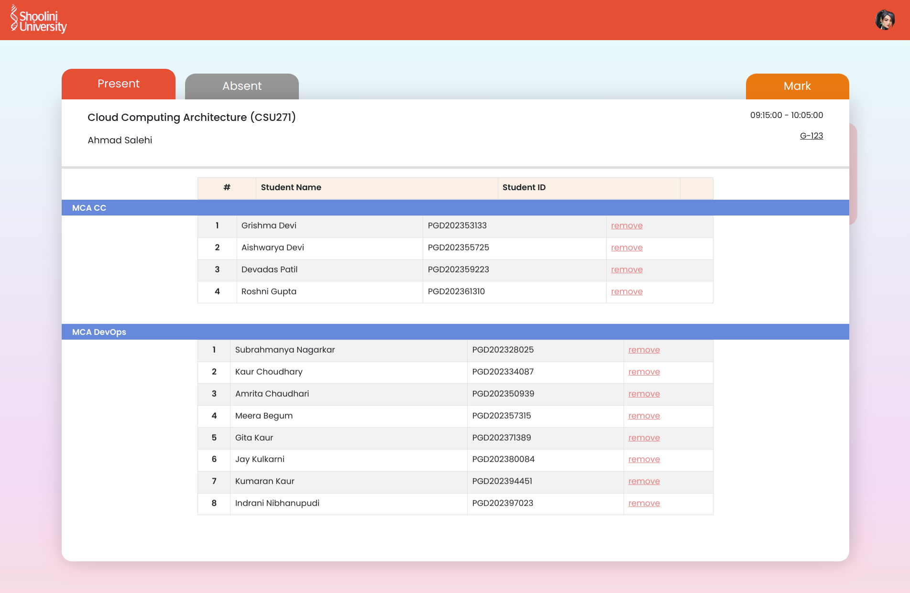
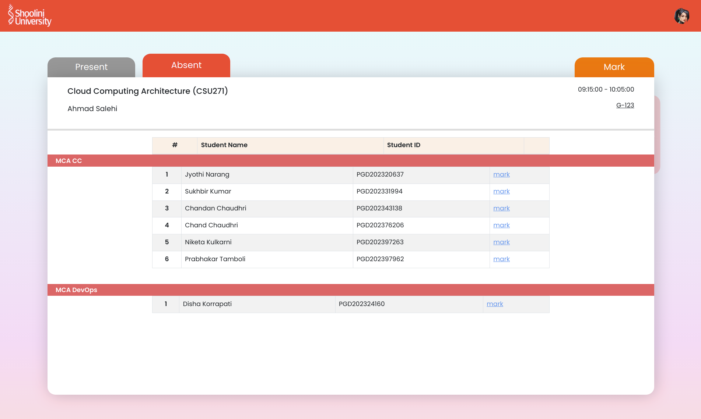
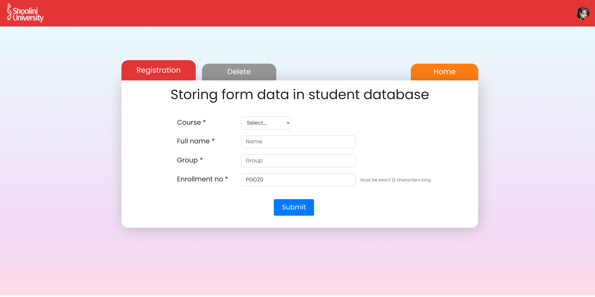
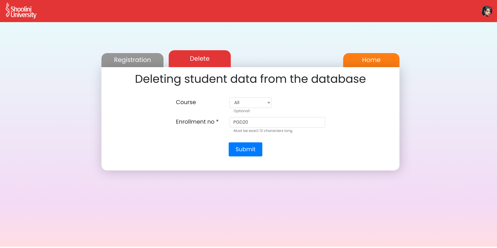

# ATD
Our attendance marking system is a comprehensive solution designed to streamline the process of recording attendance in various educational or organizational settings. Built using JavaScript, HTML, CSS, and PHP, this system offers an intuitive interface for both administrators and users. With its user-friendly design, it simplifies attendance tracking, allowing users to mark their presence efficiently.

This system serves a variety of use cases, including classrooms, meetings, workshops, and conferences. Administrators can effortlessly manage attendance records, track attendance trends, and generate reports for analysis. Users benefit from the convenience of marking their attendance electronically, eliminating the need for traditional paper-based methods.

By leveraging modern web technologies, our attendance marking system enhances efficiency, accuracy, and accessibility, ultimately improving the overall attendance management process for organizations and educational institutions alike.


<!-- TOC -->
* [ATD](#atd)
  * [Installation](#installation)
    * [Step 1: Download Swagger UI from GitHub](#step-1-download-swagger-ui-from-github)
    * [Step 2: Install Swagger-PHP using Composer](#step-2-install-swagger-php-using-composer)
    * [Step 3: Set Up Swagger UI](#step-3-set-up-swagger-ui)
    * [Step 4: Configure Swagger-PHP](#step-4-configure-swagger-php)
    * [Step 5: Integrate Swagger UI with PHP](#step-5-integrate-swagger-ui-with-php)
    * [Step 6: Test the Integration](#step-6-test-the-integration)
  * [Directory Structure](#directory-structure)
  * [Usage](#usage)
    * [Features](#features)
    * [Screenshots](#screenshots)
  * [Future Updates](#future-updates)
  * [References](#references)
<!-- TOC -->


## Installation
To set up your project with the required version of Swagger UI for documentation, follow these steps:

### Step 1: Download Swagger UI from GitHub
Visit the Swagger UI GitHub repository and download the latest version of Swagger UI.

### Step 2: Install Swagger-PHP using Composer
Make sure you have Composer installed. If not, you can download it from getcomposer.org.
In your project directory, run the following command to install Swagger-PHP:

```bash
composer require zircote/swagger-php:^3.2.0
```
Ensure that you specify version **'3.2.0'** or higher to meet the requirements.

### Step 3: Set Up Swagger UI
Place the downloaded Swagger UI files in your project directory. You can choose to integrate it directly into your PHP project or host it separately.

### Step 4: Configure Swagger-PHP
You may need to configure Swagger-PHP according to your project's needs. Refer to the Swagger-PHP documentation for instructions on configuration.

### Step 5: Integrate Swagger UI with PHP
Integrate Swagger UI into your PHP project by linking the Swagger UI files and configuring them to work with your Swagger-PHP-generated documentation.

### Step 6: Test the Integration
Test your Swagger UI integration to ensure that the documentation is being generated correctly and is accessible through your PHP application.


## Directory Structure
We've outlined the folder structure to provide a clear overview of how the project is organized. This structure 
helps developers navigate through different components efficiently and understand where specific functionalities are located. Below, you'll find a brief description of each folder to guide you through the project's architecture.
```
.
├── api_files
│   ├── config
│   │   └── Database.php
│   ├── controller
│   │   ├── students
│   │   │   ├── createstudent.php
│   │   │   ├── deletestudent.php 
│   │   │   └── getstudents.php
│   │   └── timetable
│   │       ├── readsubject.php
│   │       └── readtime.php
│   ├── documentation
│   │   └── api.php
│   │   └── index.php
│   └── models
│       ├── Students.php
│       └── TimeSlot.php
├── Images
│   ├── database-design.png
│   ├── Desktop - 1.png
│   ├── Desktop - 2.png
│   ├── Desktop - 3.png
│   └── Desktop - 4.png
├── js
│   ├── api
│   │   ├── apiEndpoints.js
│   │   ├── student.js
│   │   ├── subject.js
│   │   └── timetable.js
│   ├── apstatus.js
│   ├── attend.js
│   ├── login.js
│   └── timet.js
├── media
│   └── images
│       ├── icon.png
│       └── sage.png
├── POST
│   ├── form.css
│   ├── index.php
│   ├── insert.php
│   ├── delete.php
│   ├── message.php
│   └── validate.js
├── public
│   ├── apstatus.php
│   ├── attend.php
│   ├── login.php
│   └── timet.php
├── sql
│   └── schema.sql
├── src
│   ├── logout.php
│   ├── markAttend.php
│   ├── students.php
│   ├── studentsTable.php
│   ├── timeSlot.php
│   └── validateLogin.php
├── style
│   ├── atstatus_pa.css
│   ├── attend_style.css
│   ├── default.css
│   ├── login_style.css
│   └── time_slot.cs
└── index.php
```

<details>
  <summary><b>Details about directory structure</b></summary>

| Dir & sub-dir        | Description                                                                                            |
|----------------------|--------------------------------------------------------------------------------------------------------|
| api_files            | Contains the files for the API                                                                         |
| api_files/config     | Contains configuration files necessary for setting up the API, such as database credentials            |
| api_files/models     | Holds PHP files defining data structures and interactions with the database.                           |
| api_files/controller | Houses PHP files responsible for handling incoming requests, processing data, and generating responses. |
| .htaccess            | Configuration file for Apache web server, used for URL rewriting and other server-level settings.      |
| Images               | Images of the project.                                                                                 |
| js                   | Javascript files for the project                                                                       |
| media                | Images used in the project.                                                                            |
| POST                 | Contains the fiels for posting the data into the student database.                                     |
| public               | PHP files that are publicly accessible through webpage.                                                |
| sql                  | Schema for the SQL database with sample data entries.                                                  |
| src                  | Contains PHP helper files that assist in various tasks.                                                |
| style                | CSS files for the project.                                                                             |

</details>

<details>
  <summary><b>Details about file structure</b></summary>

| Files                | Description                                                                                            |
|----------------------|--------------------------------------------------------------------------------------------------------|
| api_files            | Contains the files for the API                                                                         |
| api_files/config     | Contains configuration files necessary for setting up the API, such as database credentials            |
| api_files/models     | Holds PHP files defining data structures and interactions with the database.                           |
| api_files/controller | Houses PHP files responsible for handling incoming requests, processing data, and generating responses. |
| .htaccess            | Configuration file for Apache web server, used for URL rewriting and other server-level settings.      |
| Images               | Images of the project.                                                                                 |
| js                   | Javascript files for the project                                                                       |
| media                | Images used in the project.                                                                            |
| POST                 | Contains the fiels for posting the data into the student database.                                     |
| public               | PHP files that are publicly accessible through webpage.                                                |
| sql                  | Schema for the SQL database with sample data entries.                                                  |
| src                  | Contains PHP helper files that assist in various tasks.                                                |
| style                | CSS files for the project.                                                                             |

</details>


## Usage
The attendance project is designed to streamline the process of tracking attendance for students in various courses. It provides a user-friendly interface for administrators to manage attendance records efficiently.
- **Configuration**: Configure the project settings according to your requirements. This may include setting up database connections, defining course structures, and configuring user permissions.
- **Adding Students**: Add student profiles to the system. Include relevant details such as student name, ID, and course enrollment.
- **Managing Courses**: Create courses and assign students to them. Specify course schedules and other relevant information.
- **Recording Attendance**: Use the provided interface to record attendance for each session or class. Mark students as present, absent, or tardy.
- **Generating Reports**: Utilize the reporting functionality to generate attendance reports. View reports for individual students, courses, or date ranges.

### Features
- **Student Management**: Easily add, edit, and delete student profiles.
- **Course Management**: Organize students into courses and manage course details.
- **Attendance Tracking**: Record student attendance for each session or class.
- **Reporting**: Generate attendance reports for individual students or entire courses.

### Screenshots
Include screenshots of the project interface to provide visual references for users. Screenshots could showcase 
features such as the student management dashboard, course details page, attendance recording form, and generated reports. \
1. Login Page

2. Select a specific time frame

3. A small pop-up to show how it works

4. Mark the attendance of the student

5. Check the status of the present students

6. Check the status of the absent students

7. Post page to add new student data

8. Delete page to delete existing student data



## Future Updates
Here are some potential future updates:
1. Enhanced User Roles and Permissions:
   - Implement role-based access control to differentiate between administrators, instructors, and students.
   - Fine-tune permissions to allow or restrict specific actions based on user roles.
2. Dynamic Course Management:
   - Allow instructors to create and manage courses directly from the platform.
   - Enable course enrollment for students, including self-registration options.
3. Teacher Management:
   - Introduce functionality to add, remove, and manage teacher profiles.
   - Assign teachers to courses and grant administrative privileges as needed.
4. Flexible Timeframe Selection:
   - Provide options to customize class schedules and timeframes based on individual course requirements.
   - Allow for the selection of recurring classes, irregular schedules, and holiday exceptions.
5. Attendance Analytics and Insights:
   - Integrate advanced analytics to provide insights into attendance trends and patterns.
   - Visualize attendance data through charts and graphs to facilitate decision-making.
6. Mobile Accessibility and App Integration:
   - Develop a mobile-responsive interface to ensure accessibility on smartphones and tablets.
   - Consider building dedicated mobile apps for iOS and Android platforms for on-the-go access.
7. Integration with External Systems:
   - Integrate with existing learning management systems (LMS) or student information systems (SIS) for seamless data synchronization.
   - Enable single sign-on (SSO) capabilities to streamline user authentication across multiple platforms.
8. Feedback and Evaluation Mechanisms:
   - Incorporate mechanisms for collecting feedback and evaluations from students and instructors.
   - Use feedback data to continuously improve course content, teaching methods, and platform usability.

